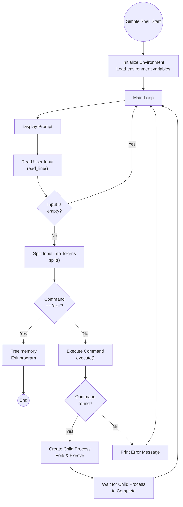

# Simple Shell Project - Holberton School C :exclamation:

## Description :pushpin:

This project contains all the necessary files to compile a `simple_shell`, a command-line interpreter similar to the Unix shell. It reads commands from the user, parses them, and executes the corresponding programs in the system.

## Compilation Command and Requirement :computer:

The project is compiled with the `gcc`command and also with the next options `-Wall -Werror -Wextra -pedantic -std=gnu89` to enforce strict code quality and catch warnings as errors. All files will be compiled on Ubuntu 20.04 LTS.

```bash
gcc -Wall -Werror -Wextra -pedantic -std=gnu89 *.c -o prog
```

## Betty Style :black_nib:
All the files are written with the [Betty coding style](https://www.holbertonschool.fr/post/quest-ce-que-la-regle-betty-dans-le-langage-de-programmation-c)

## Repository files list :newspaper:
| File name          | Description                                                                  |
| -----------------: | ---------------------------------------------------------------------------- |
| [main.c](main.c)          | Contains the main function and the main loop of the shell                                       |
| [prompt.c](prompt.c)     | Displays the shell prompt to the user |
| [read_line.c](read_line.c)       | Reads user input from standard input   |
| [split.c](split.c)     | Splits the input string into tokens/arguments |
| [execute.c](execute.c)         | Executes commands by finding and running the corresponding program |
| [environnement.c](environnement.c)         | Manages environment variables |
| [main.h](main.h)             | Contains all headers, prototypes and structures needed                    |
| [man_1_simple_shell](man_1_simple_shell)       | This is the man page of our simple_shell                                          |
| [AUTHORS](AUTHORS)         | Contains the list of project authors |

## Flowchart :ocean:

Here is the flowchart that we followed during the development of our simple_shell project:



## How to use simple_shell :question:

1. **Compile the project:**
   ```bash
   gcc -Wall -Werror -Wextra -pedantic -std=gnu89 *.c -o prog
   ```

2. **Run the shell:**
   ```bash
   ./prog
   ```

3. **Enter commands:**
   Once the shell is running, you can execute any command available in your system:
   ```bash
   $ ls -la
   $ pwd
   $ echo "Hello, World!"
   $ exit
   ```

## Features :gear:

- Display a prompt and wait for user input
- Parse and execute commands
- Handle environment variables
- Support for command arguments
- Exit functionality

## Examples :exclamation:

```bash
$ ./prog
$ ls
AUTHORS     execute.c     main.h         prompt.c       split.c
README.md   environnement.c   main.c    man_1_simple_shell    read_line.c

$ pwd
/home/alex/Holberton/Cours_C/holbertonschool-simple_shell

$ echo Hello World
Hello World

$ exit
$
```

## Project Authors :dancers:
- [MOUYSSET Alexandre](https://github.com/alexandre-mouysset)
- [Zinini Nabil](https://github.com/zinininabil-stack)